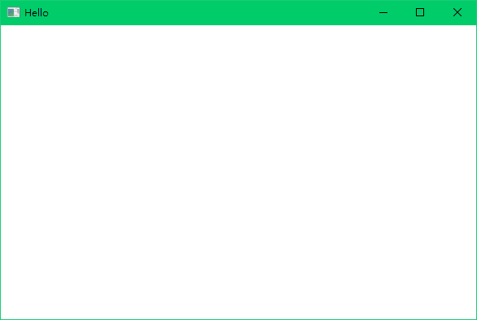

# Zlibx

Zlibx是一个轻量级的Windows开发SDK，封装了部分常用的API。SDK是UI方面为主，但也有许多拓展。

开发初心是因为个人认为Qt、MFC等都过于重量级，同时对新手并不是非常友好<s>（为了方便自己后续摸鱼&做一些Demo）</s>。

这个框架可能并不能很好的进行一些深度定制化操作，有这方面需求的请移步。

这里照例放一个最简单的Demo

~~~c++
#include "ZWindow.h"
int main(){
    auto win = new ZWindow(L"Hello",300,300,600,400);
    win->Create();
    win->Run();
}
~~~

下面是运行效果

有什么想法欢迎在issue中提出来，如果你是有能力的人也欢迎为此项目贡献代码。

---

**This program make by [kaoru](github/shiinasama).**

~~~
MIT License
Copyright (c) 2020 Kaoru
Permission is hereby granted, free of charge, to any person obtaining a copy
of this software and associated documentation files (the "Software"), to deal
in the Software without restriction, including without limitation the rights
to use, copy, modify, merge, publish, distribute, sublicense, and/or sell
copies of the Software, and to permit persons to whom the Software is
furnished to do so, subject to the following conditions:
The above copyright notice and this permission notice shall be included in all
copies or substantial portions of the Software.
THE SOFTWARE IS PROVIDED "AS IS", WITHOUT WARRANTY OF ANY KIND, EXPRESS OR
IMPLIED, INCLUDING BUT NOT LIMITED TO THE WARRANTIES OF MERCHANTABILITY,
FITNESS FOR A PARTICULAR PURPOSE AND NONINFRINGEMENT. IN NO EVENT SHALL THE
AUTHORS OR COPYRIGHT HOLDERS BE LIABLE FOR ANY CLAIM, DAMAGES OR OTHER
LIABILITY, WHETHER IN AN ACTION OF CONTRACT, TORT OR OTHERWISE, ARISING FROM,
OUT OF OR IN CONNECTION WITH THE SOFTWARE OR THE USE OR OTHER DEALINGS IN THE
SOFTWARE.
~~~