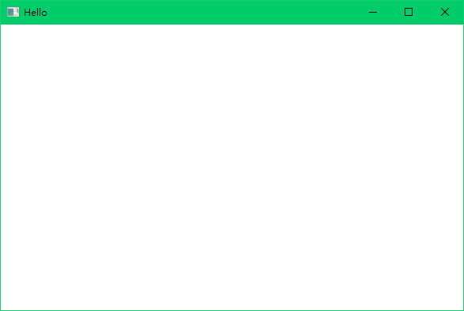

# Zlibx

Zlibx是一个轻量级的Windows开发SDK，封装了部分常用的API。SDK是UI方面为主，但也有许多拓展。

开发初心是因为个人认为Qt、MFC等都过于重量级，同时对新手并不是非常友好<s>（为了方便自己后续摸鱼&做一些Demo）</s>。

这个框架可能并不能很好的进行一些深度定制化操作，有这方面需求的请移步。

这里照例放一个最简单的Demo

~~~c++
#include "ZWindow.h"
int main(){
    auto win = new ZWindow(L"Hello",300,300,600,400);
    win->Create();
    win->Run();
}
~~~

下面是运行效果

有什么想法欢迎在issue中提出来，如果你是有能力的人也欢迎为此项目贡献代码。